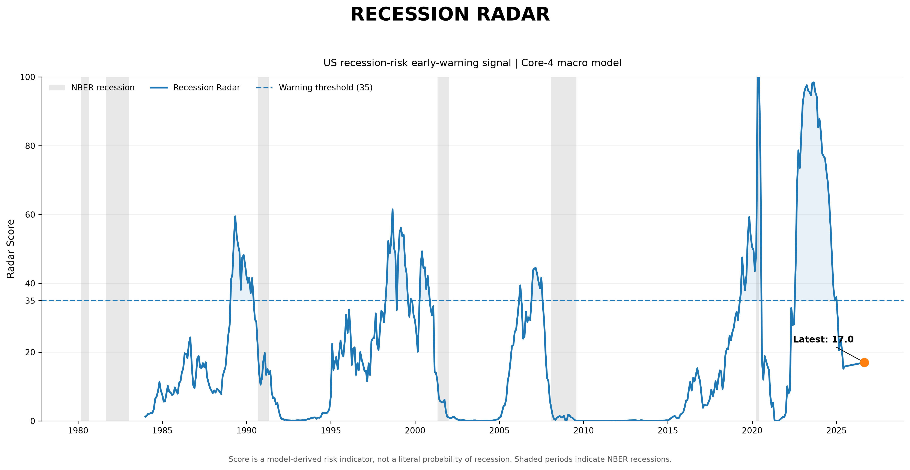
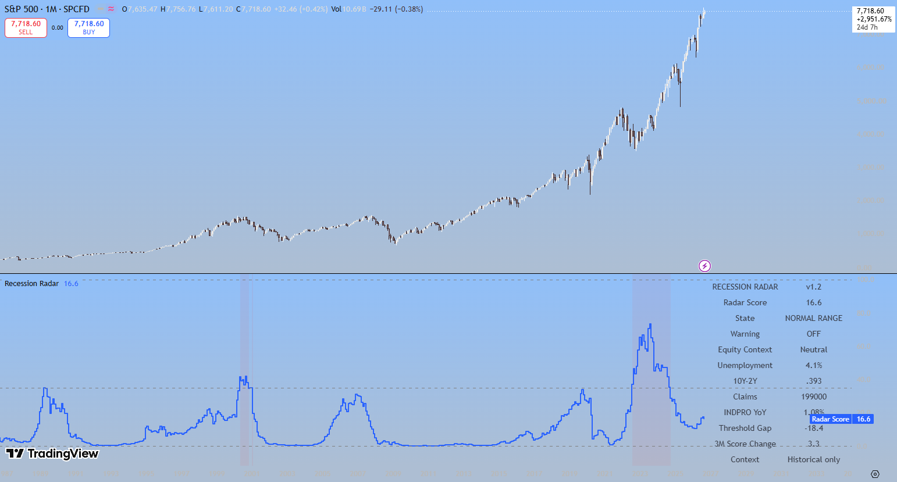

# Recession Radar

A point-in-time-aware US recession-risk early-warning system built using public macroeconomic data from FRED and ALFRED.

Recession Radar combines four macro indicators into a live 0–100 risk score using a frozen logistic regression model, with historical validation, automated production checks, feature-level attribution and a TradingView deployment.

---

## Current Reading

**Radar Score:** 17.0  
**State:** Normal Range  
**Warning:** OFF  
**Warning Threshold:** 35.0

The current score is below the warning threshold and sits around the middle of the historical distribution.

> Recession Radar is a macroeconomic regime indicator. The score should not be interpreted as a literal probability of recession.

## Historical Recession Radar Signal



The chart shows the historical Recession Radar score, the fixed warning threshold of 35, and NBER recession periods. The score is a model-derived risk indicator rather than a literal recession probability.

---

## Core Indicators

The production model uses four economic indicators:

| Indicator | FRED Series | Role |
|---|---|---|
| Unemployment Rate | `UNRATE` | Labour-market conditions |
| 10Y–2Y Treasury Spread | `T10Y2Y` | Yield-curve / monetary-cycle stress |
| Initial Jobless Claims | `ICSA` | Faster-moving labour-market deterioration |
| Industrial Production | `INDPRO` | Real-economy activity |

All four are standardised before entering the logistic regression model.

---

## Model

The production version uses:

- StandardScaler
- Logistic Regression
- Four frozen macroeconomic features
- Fixed warning threshold of 35
- Monthly observation frequency

The model is intentionally kept simple.

More complex feature-engineering variants were tested but did not improve performance enough to justify the additional complexity and did not adequately resolve the major 2022–24 false-warning regime.

---

## Point-in-Time Validation

The headline point-in-time-aware historical evaluation produced:

| Metric | Result |
|---|---:|
| ROC AUC | **0.848** |
| Precision-Recall AUC | **0.256** |
| Holdout Precision | **0.321** |
| Holdout Recall | **0.708** |
| Holdout F1 | **0.442** |

The holdout period covered 2005–2025.

The model detected both the 2008 and 2020 recession starts within the 12-month warning horizon.

Historical feature construction is designed to reduce look-ahead bias by approximating the information that would have been available at the time.

---

## Methodology

The target is defined as:

> A recession start occurring within the next 12 months.

At month `t`, the target equals 1 if an NBER recession begins during months `t+1` through `t+12`.

This makes Recession Radar an early-warning system rather than a contemporaneous recession classifier.

The production workflow is:

```text
FRED / ALFRED macro data
          ↓
Point-in-time feature construction
          ↓
Core-4 standardisation
          ↓
Frozen logistic regression
          ↓
0–100 Radar Score
          ↓
Warning threshold / percentile / drivers
          ↓
TradingView + historical market context

---

## TradingView Implementation

Recession Radar has also been implemented in **Pine Script v6** as a live TradingView indicator using the frozen Core-4 model.



The TradingView dashboard displays:

- Radar Score
- Signal State
- Warning status
- Historical equity context
- Unemployment rate
- 10Y–2Y Treasury spread
- Initial jobless claims
- Industrial production YoY growth
- Distance from the warning threshold
- 3-month change in the Radar Score

The Pine implementation uses the same frozen Core-4 logistic regression coefficients as the Python production model.

Because TradingView accesses currently available FRED series, historical values displayed by the Pine implementation may incorporate subsequent revisions to macroeconomic data. It should therefore be viewed as a live deployment and historical proxy rather than a perfect reconstruction of the point-in-time research dataset.

The Pine Script source is available at:

`tradingview/recession_radar_v1_2.pine`

The indicator is currently maintained as a private TradingView script; the full Pine source is publicly available in this repository.